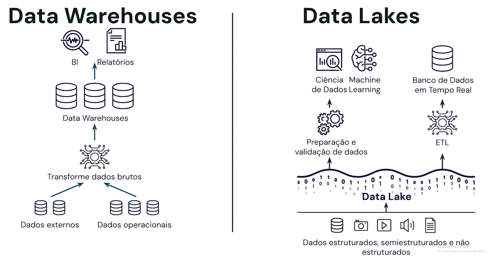
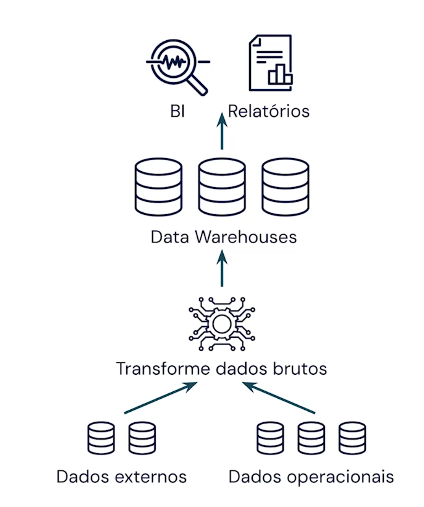
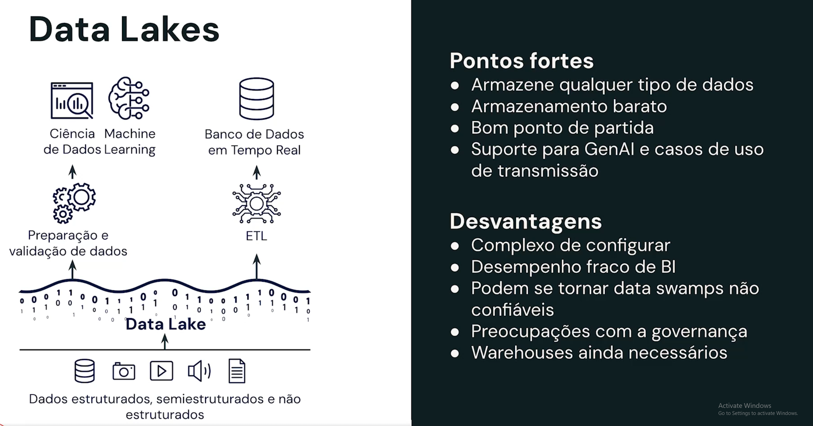
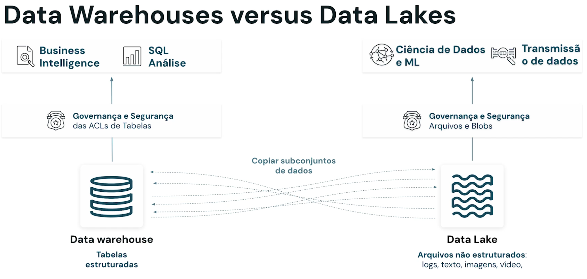
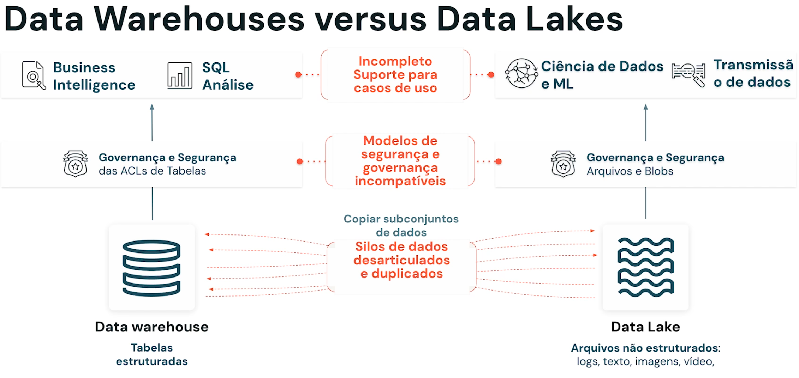
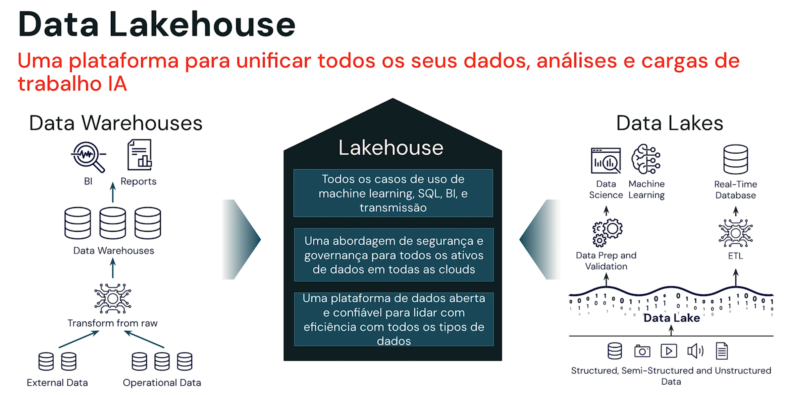
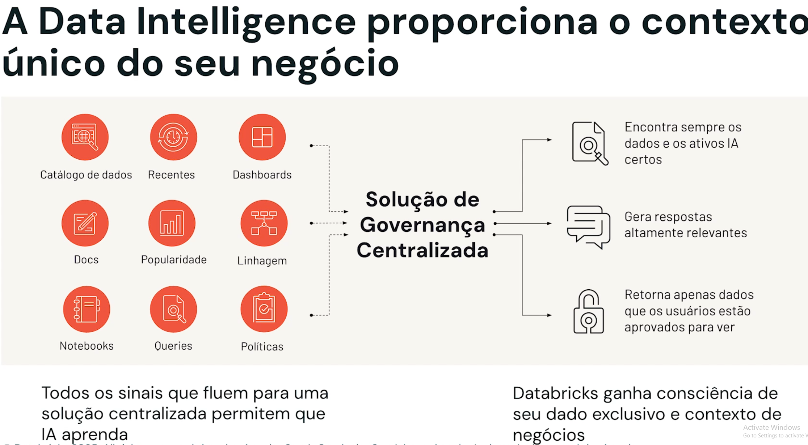

# Databricks

Diretório para manter minhas anotações sobre os conhecimentos adquiridos nos cursos da Databricks

## Oque é `warehouses`, `data lakehouses` e `data intelidence plataforms`?

* Data likehouses é a base para data inteligence platform.

### Data Warehouses

* Criado especificamente para BI e relatórios;
* Destinado a unificar sistemas díspares;
* Abriga dados estruturados e limpos com um esquema padronizado;
* Não há suporte para dados semi ou não estruturados;
* Suporte insuficiente para casos de uso de ciência de dados, IA e tranmissão;
* Utiliza formatos fechados e proprietários;
* Caro para escalar;

### Data lakes

* É um sistema de dados não estruturado ou semiestruturado que permite o armazenamento de grandes quantidades de dados brutos ou sem formato;

### **Data Warehouse X Data Lakes**

## Data Lakehouses

## Data intelligence plataform

